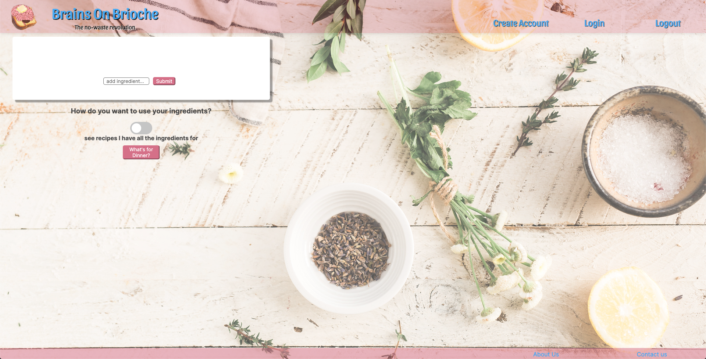

<div align="center">

# Brains On Brioche (B.O.B) 

<br>
<br>

[](#contributors) <br>
[](#project-description) | 
[](#demo) | 
[](#technologies-used) | 
[](#how-to-run-locally) | 
[](#card-wall) | 
[](#team-approach) <br>
[](#user-stories) | 
[](#further-user-stories) | 
[](#minimum-viable-product-mvp) | 
[](#wireframes) | 
[](#edge-cases) | 
[](#future-integrations)

</div>

<br>

## Contributors
- [Alexandros Papagiannis](https://github.com/Alexandros91)
- [Archie Martin](https://github.com/archiemartini)
- [Farzan Imanzadeh](https://github.com/Farzan-I)
- [Jimmy Lyons](https://github.com/jimmy-lyons)
- [Stevie Spiegl](https://github.com/S-Spiegl)

## Project description
Welcome to Brains On Brioche (BoB), our final engineering project of the Makers Academy bootcamp. BoB is a web app that keeps track of the contents of a user's pantry and provides them with a range of exciting recipes. 

Food waste is a growing problem with a significant carbon footprint. Every kilogram of food that goes in the bin represents over 2.5kg of CO<sub>2</sub> emissions in terms of the resources that went into producing it. Furthermore, once that food reaches landfill, it breaks down to produce methane, a greenhouse gas 25 times more potent than CO<sub>2</sub>. Apart from its impact on the planet, food waste also represents a financial burden, while making interesting meals on a budget can be challenging. Against the backdrop of growing inflation, energy crises, and a global food crisis, technology represents an important method of ameliorating this situation on a personal level. By allowing a user to keep track of food in their kitchen, BoB injects variety into mealtime. If frugality is key, a user can set the search to prioritise recipes that require the fewest additional ingredients; if the aim is to use up food, the user can have the search bring back recipes that use up the most ingredients (but which may also result in buying more).  In addition to the basic info such as ingredients and instructions, BoB also takes into account special dietary requirements, allowing a user to check whether a meal is gluten-free, low FODMAP etc. 

The app uses an external API from [Spoonacular](https://spoonacular.com/food-api) to access thousands of recipes from many different cuisines, so the user can find recipes even with ingredients that at first glance might seem completely incompatible. Whether you're the kind of person who struggles to boil an egg, or you're waiting for your michelin star, BoB has something for you. Upon signing up, a user is able to add items to their 'fridge' and save them there (or, in reality, in our cloud-hosted database). They can add and remove items as is required to build an accurate picture of what is at their disposal. 

We had a great time building this app, and we hope you will find it equally useful and fun to use. We are more than open to hear your opinion and any constructive crisicism that would improve our program even further. 

## Demo
### Home page

### Non-signed up/in user recipe search (1/2)

### Non-signed up/in user recipe search (2/2 - showing the instructions on the left)

### New user (Lucy) trying to log in without valid email

### New user (Lucy) has logged in (with correct details)

### Lucy has stocked up her fridge and storeds in database

### Lucy searches for recipes using the fridge contents

### Lucy searches for recipes using more than the fridge contents

### About us / Contact us footer dropdown(up) menus


## Technologies Used
- [Axios](https://axios-http.com/) - promise based HTTP client for the browser and node.js.
- [CSS](https://www.w3.org/Style/CSS/Overview.en.html) - styling of the webpages.
- [Cypress](https://www.cypress.io/) - for end-to-end testing.
- [ESLint](https://eslint.org) - for linting of the code.
- [Express](https://expressjs.com/) - web framework for Node.js.
- [Jest](https://jestjs.io/) - for testing of the code.
- [MongoDB](https://www.mongodb.com/) - for our database needs.
- [Mongoose](https://mongoosejs.com) - to model objects in MongoDB.
- [Nodemon](https://nodemon.io/) - to reload the server automatically.
- [React](https://reactjs.org/) - to build user interfaces.
- [Redux](https://redux.js.org/) - to help with consistency across client, server, and native environments and make testing easier.

## How to run locally

### Set up

**Before doing anything, please sign up to the [Rapid api for spoonacular](https://rapidapi.com/spoonacular/api/recipe-food-nutrition) and subscribe to the test api to be able to make your own authorisation token (this requires submitting your card details - please note that there is an initial small charge, and that there are limits to how many API calls you can make in a day before being charged)**

1. Fork this repository (optional)
2. Clone your fork (or this repo) to your local machine 
3. Navigate to the project directory in command line/terminal and run `npm install`
4. Navigate to the server folder in a separate terminal using `cd server` and run `npm install`
5. In the same folder (server) create a `auth.js` file and put in it your authKey/API-Key obtained from Rapid Api's website in the following format:
```
const authKey = '<YOUR-AUTHKEY-IN-COMMAS>'

export default authKey;
```
6. In another terminal, navigate to the client folder using `cd client` and run `npm install`
7. With two terminals open (one in the server folder and the other in the client folder), run `npm start` in both, first in the server then in the client
8. This starts the server connection (app to database, app to the API) and automatically opens the website to `localhost:3000`
9. Create an account (if you want to store your fridge contents for later use) and start typing in the ingredients you want recipes for, one at a time please
10. Click on the recipe you find most intriguing and maybe even adjust the search to show more adventurous recipes!

#### Cypress Testing
* To install Cypress enter the `npm install cypress --save-dev` command.
* To open Cypress enter `npx cypress open`.

#### Configuration
* If you run into any problems when using `npm install` to install dependencies, the following commands can be used to overcome the setbacks in case the node modules
do not install properly:
```
npm config set legacy-peer-deps true
```
```
npm install --save --legacy-peer-deps
```

## Card wall
We used a [Trello](https://trello.com/b/b9m4qtRa/brainsonbrioche) board to keep track of the features we want to implement. We organised tickets amongst the team and moved the tickets accordingly to demonstrate at what stage that feature's at (To do/In progress/In review etc.).


### Diagramming
#### JavaScript sequence Diagram

#### Early Sequence Diagram

#### Final Sequence Diagram


## Team approach
* Standups every morning at 10:00
* Retro at 5:30 every evening
* Pair programming throughout the whole project
* Use of mobbing to ensure every member understands the code and eliminate blockers
* Regular check-ins with team members to make sure nobody was left behind
* Trello board for distributing work and staying on track

## User stories
```
As a user,
So that I can create a meal from the items in my fridge,
I would like to be able to search for recipes by typing in my ingredients to a search bar.
```
```
As a user, 
So that I can make a complete meal, 
I want to see recipes which only contain the ingredients I have entered.
```
```
As a user,
So that I can cook a recipe that I've searched for,
I would like to see the steps of the recipe.
```
```
As a user,
So that I can have all the ingredients I need for the recipe,
I would like to see a list of the ingredients I am missing.
```
```
As a user,
So that I don't have to enter ingredients everytime,
I would like to have a fridge that saves all my available ingredients.
```

## Further User Stories
```
As a user,
So that I can save all of my progress,
I want to be able to create an account and store my ingredients.
```
```
As a user,
So that no one can access my ingredients,
I'd like to be able to sign out.
```
```
As a user,
So that I know what the company is about,
I'd like to access more information about the company in an about us section.
```
```
As a user,
So that I can contact the company with feedback,
I'd like to see a contact us page with the company's details.
```
## Minimum Viable Product (MVP)
<details>
<summary> Search bar on the home page 🍽</summary>

* User can see a search bar 🔎
* User can type an ingredient one by one 🧀
* User gets recipes given back with their selected ingredients 🍝
</details>

<br>

## Wireframes
### Figma wireframe (early development)

### Board wireframe (late development)


## Edge cases
* Sign up with invalid input
* Ingredients don't get saved if the user is not signed up/signed in
* Clicking on a certain recipe, it shows only the recipe's information (ingredients, measurements and instructions)

## Future integrations
* When a user arrives, they can't see the log out button
* When the user signs in, they can only see the log out button, not create account or sign in options
* User can filter recipes to show only the ones from a specific diet (lactose free, vegan, gluten free, low FODMAP etc.)
* User can pick a random recipe that has all their ingredients and they have to make it
* Instigate a forum section so users can share ideas, comment on recipes and build a Brains On Brioche community!
* User can only sign up once with a specific email address

# The brains behind the brioche

